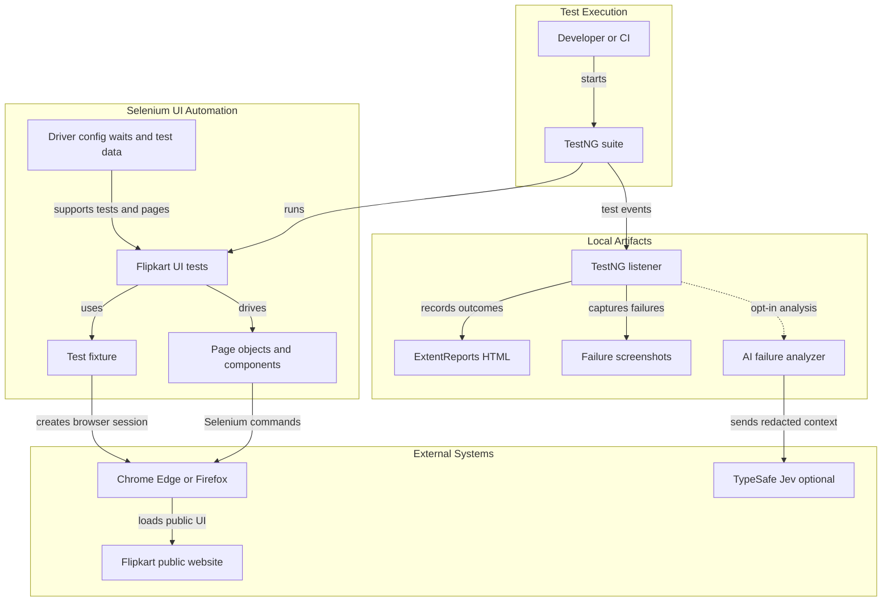
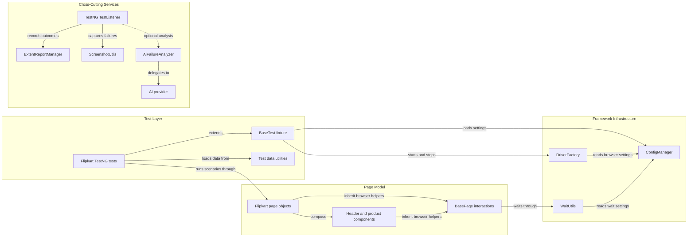

# Architecture Diagram

This document describes the current Selenium and TestNG UI automation framework. It focuses on browser-driven Flipkart scenarios, shared test infrastructure, and optional AI-assisted failure reporting.

## Application Architecture

<!-- mermaid-checked: no \n, no em-dash/en-dash, no {} in labels, subgraphs are id["label"], arrows are -->|"label"|, all subgraphs closed by end, ids unique -->

### Technology Stack Summary

| Layer | Technology | Version | Purpose |
|---|---|---:|---|
| Language | Java | 25 | Framework and test implementation |
| Build | Maven | Not pinned in project | Dependency and test execution |
| Test orchestration | TestNG | 7.10.2 | Test lifecycle, suites, and parallel execution |
| Browser automation | Selenium WebDriver | 4.27.0 | Drive supported desktop browsers |
| Driver management | WebDriverManager | 5.9.2 | Resolve browser driver binaries |
| Page interaction | Selenium page objects | Project code | Encapsulate Flipkart UI behavior |
| Test reporting | ExtentReports | 5.1.2 | Generate local HTML execution reports |
| AI failure analysis | TypeSafe Jev | Optional; endpoint API version not pinned | Analyze bounded, redacted failure context |
| Logging | SLF4J and Logback | 2.0.17 and 1.5.16 | Framework and test logs |
| Test data and JSON | Apache POI and Jackson | 5.3.0 and 2.18.2 | Spreadsheet utilities and JSON handling |

### Data Storage & External Services

The framework has no application database, cache, message broker, or general-purpose API test client. Selenium browser sessions access the public Flipkart website. ExtentReports HTML and failure screenshots are written to local workspace directories. Optional AI failure analysis uses the TypeSafe Jev HTTP endpoint only when enabled; the request context is bounded and redacted.

### Key Architectural Decisions

- TestNG tests use page objects and reusable UI components to separate scenario assertions from browser interaction details.
- `DriverFactory` uses a thread-local WebDriver so parallel TestNG methods have independent browser sessions.
- AI failure analysis is disabled by default and isolated behind the `AiProvider` interface, with Jev and deterministic mock implementations.

## Component Relationships

<!-- mermaid-checked: no \n, no em-dash/en-dash, no {} in labels, subgraphs are id["label"], arrows are -->|"label"|, all subgraphs closed by end, ids unique -->

### Component Inventory

| Component | Layer | Type | Responsibility |
|---|---|---|---|
| Flipkart TestNG tests | Test Layer | Test cases | Validate safe public UI flows and assert outcomes |
| `BaseTest` | Test Layer | Test fixture | Load configuration and manage suite and method lifecycle |
| Test data utilities | Test Layer | Utility | Provide test inputs from project resources |
| Flipkart page objects | Page Model | Page objects | Encapsulate home, search, product, and cart interactions |
| Header and product components | Page Model | UI components | Reuse search header and product-card behavior |
| `BasePage` | Page Model | Base class | Share browser actions and explicit-wait helpers |
| `DriverFactory` | Framework Infrastructure | Factory | Create and clean up thread-local browser sessions |
| `ConfigManager` | Framework Infrastructure | Configuration | Load environment settings and system-property overrides |
| `WaitUtils` | Framework Infrastructure | Utility | Apply explicit waits for browser state and elements |
| `TestListener` | Cross-Cutting Services | TestNG listener | Observe test outcomes, capture failures, and optionally analyze them |
| `ExtentReportManager` | Cross-Cutting Services | Reporting service | Create, update, and flush HTML test reports |
| `ScreenshotUtils` | Cross-Cutting Services | Utility | Capture browser screenshots for failed tests |
| `AiFailureAnalyzer` | Cross-Cutting Services | Analyzer | Build provider configuration and analyze sanitized failure context |
| AI provider | Cross-Cutting Services | Provider interface | Isolate optional Jev and mock analysis implementations |
